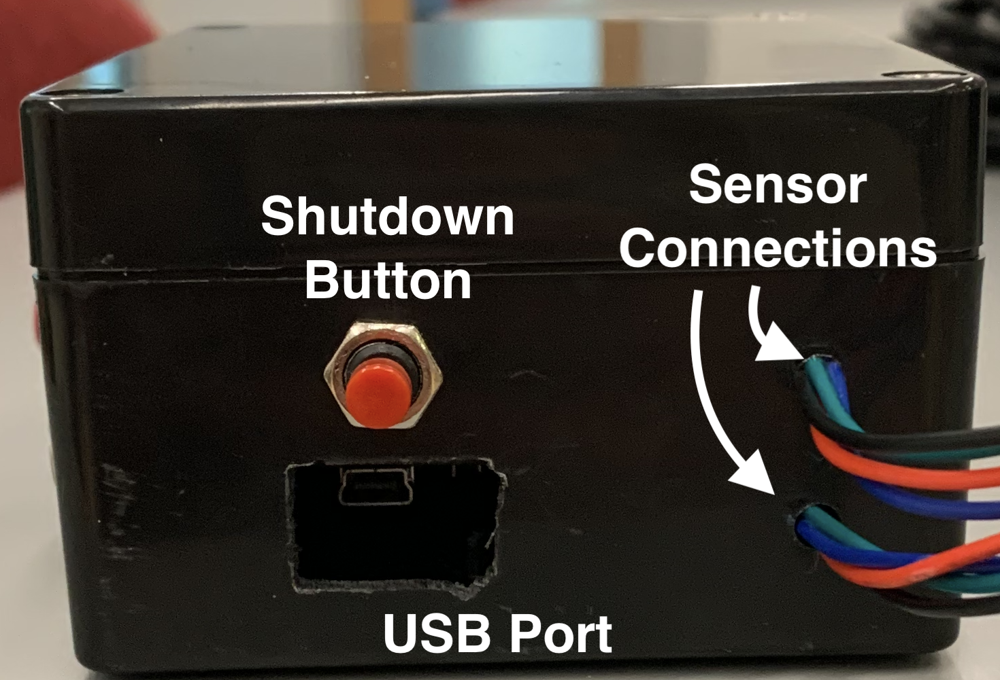
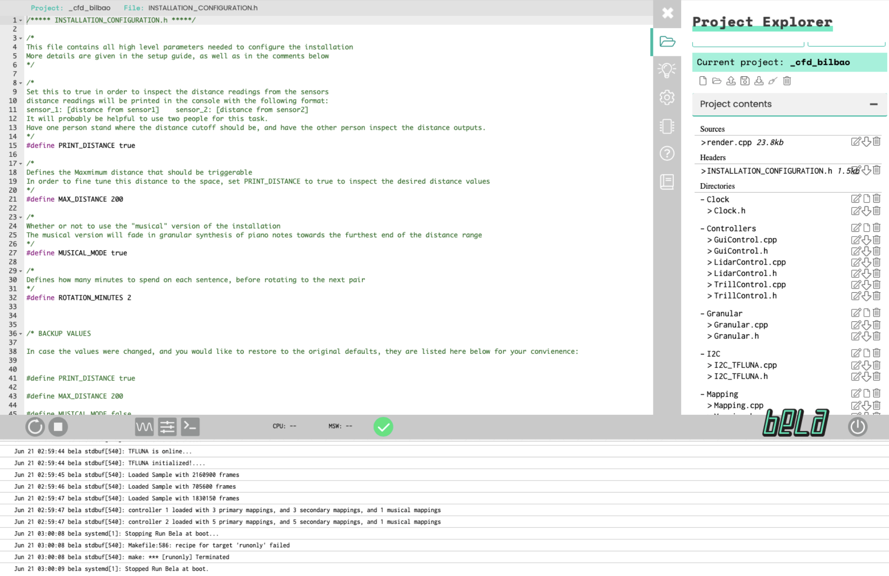
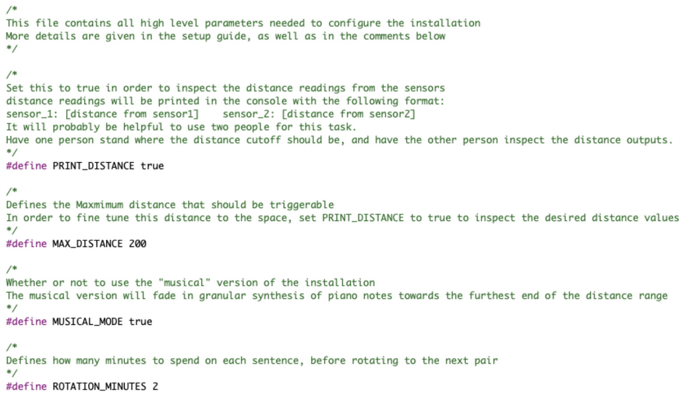
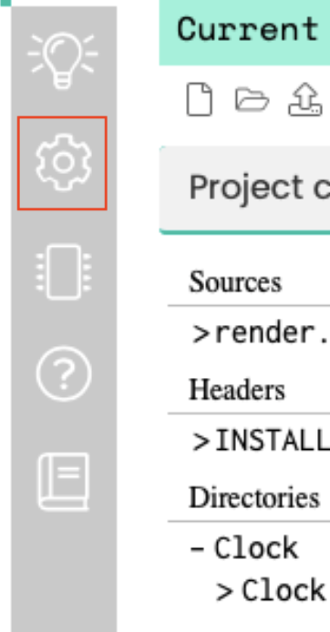

# Installation Setup Procedure   *DRS Conference - Bilbao 2022*

## Table of Contents

- [overview of materials](#overview---materials)
- [material descriptions](#material-descriptions)
    - [Shutdown Button](#shutdown-button)
    - [Audio Jack](#audio-jack)
    - [Sensor Connections](#sensor-connections)
    - [Volume Knob](#volume-knob)
    - [USB Port](#usb-port)
- [Sensor Setup](#device-setup)
- [Software Setup](#configuring-the-software)
    - [Connecting to the Device](#step-1---connecting-to-the-bela)
    - [Distance Configuration](#step-2---measuring-the-distance)
    - [Initiating the Program](#step-3---setting-the-program-to-run)

## **Overview** - *Materials*

### Packing List

In the shipped materials, you will find the following materials:

- 2 black plastic enclosures, containing the Bela Boards
- 2 USB Power bricks
- 2 USB cables 
- 4 distance sensor (2 with white cables, 2 with black cables)
- 4 white distance sensor mounts
- 1 clear small screwdriver
- 2 sensor extension cables (these will have the same connectors as the sensors)
- 2 audio cables

### Material Descriptions

**Bela Boxes**

These contain the Bela computers that will run the installation software.
 
The available ports / buttons are as follows:

 

#### **Shutdown Button**

This is the button to shutdown the device. To initiate shutdown, you will need to hold it down for about 5 seconds. It may take a few extra seconds after releasing for it to turn off. You will know that its off when the blue LED lights inside the box stop blinking. You can see these through the main USB port, or through the small hole to the left of the audio jack.  

The device can tend to be a bit unresponsive, especially if the program is running. If you notice that the board doesn’t turn off after holding down the button, you might need to press the button down a few more times, or hold the button down for longer. 

If the device is connected via USB to a computer, it is important that you shut the device down before removing the USB cable from the computer - It could possibly corrupt files on the device if it is not shutdown first (similar to how you eject a USB drive before removing).

#### **Volume Knob**

This will control the master volume of the audio coming out of the device. Turn right to turn the volume up, turn left to turn it down.

#### **Sensor Connections**

Each device will be controlled by 2 of the distance sensors. You will see 2 connectors sticking out of the device - 1 for each sensor. 

To connect the sensors, simply plug the end of the sensors, simply plug the end of the sensor’s cable into one of the connectors.

>**Important**: The sensors with the **white** cables **must** be plugged into the device with the **white** volume knob. The sensors with the **black** cables **must** be plugged into the  device with the **red** volume knob (and silver audio jack). Because of the wiring, the sensors will not work if these are reversed.

>**Important**: To disconnect the sensors, press down on the small latch on the connector and pull the connectors apart. The latch is on the device side of the connections
When disconnecting the sensors, please try to hold and pull from the black plastic connections - its possible that pulling on the cables might rip the cables out of the connectors

#### **Audio Jack**

The audio jack is a 3.5mm TRS audio jack. I’ve included 2 audio cables within the packing materials. The output is a stereo signal, where each of the two channels corresponds to output from one of the sensors 

#### **USB Port**

There are 2 USB cables + power bricks included in the packing materials. 

The smaller end gets plugged in to the device. The larger usb end gets plugged into the power brick (or computer if you are making configuration changes)

## **Device Setup**

**Step 1** - The first thing that should be done is to set up the sensors. 

Inside the packing materials, I’ve included a white mount for each sensor. The side of the casing acts like a latch, you can open it up and place the sensor cable inside so that the sensor sticks out the top (I believe Estefania has a video of me doing this)

The back of the casing has 3M adhesive backing - but be careful where you stick them, the adhesive is very strong…

**Step 2** - Then, connect the sensor cables to the device connectors. Consult the [cable section](#sensor-connections) on how to do this. It is very important that the cable colors are matched to the right devices, otherwise the sensors will not work

**Step 3** - The last step is connect the device to a power source, via the [USB port](#usb-port). When the installation is left to run, this should be plugged in to the power brick. 
However, before leaving the installation running, there is some quick configuration that must be done, which requires the device to be plugged into a computer. This **MUST** be done before the installation will run. Read on in the next section…

## **Software Setup**

Since I was not familiar with the installation space when building the software, the max distance must be defined for the sensor trigger range. As defined now in the software, the distance is set to 400, or approximately 4 meters. Following the below steps will allow you to configure this distance value easily.

#### **Step 1 - Connecting to the Bela**

The first step is to connect your laptop to the Bela in order to edit the configuration file.

1. Plug the small end of the USB cable into the USB port of the Bela, and the other end into an available USB port in your laptop. Your laptop’s USB port will be enough to power the Bela by itself.

2. Type bela.local in your browser’s address bar. You can use whatever browser you would like.

3. When the page loads, you should see something like this:

 

4. Now you must navigate to the installation configuration file. In the `Project Explorer` pane of the right side of the screen, click `INSTALLATION_CONFIGURATION.h`. The file on your screen should now look like this: 

 

#### **Step 2 - Measuring the Distance**

This next step will walk you through how to configure the distance for the installation. 
This step will involve invoking the print_distance mode of the software. This mode will print out the distance readings from both of the sensors in the console (the bottom of the page). 

The distances will be printed in the following format: 

    sensor_1: [distance1]        sensor_2: [distance2]

The number being printed represents the distance reading from the sensor. The larger the number, the larger the distance.

It is recommended to use two people for this step. 
Have one person stand in front of a sensor where the maximum distance should be, and have the other person look at the distance value that is being printed from that sensor.  Write down the desired value to reference. 

This value should be in the hundreds (the unit is roughly correlated to centimeters, although it is definitely not exact). I would not recommended having the maximum distance be any number greater than 700. (it has not been tested rigorously past this point)

1. First, set PRINT_DISTANCE to true. This will tell the device to print out the distance readings from the sensors. The line should now read: 
	
	#define PRINT_DISTANCE true

2. Hit the “run” button in the bottom toolbar. This is the button with the circular arrow, directly the left of the stop button

 

3. Inspect the distance readings and write down the desired maximum distances for each sensor

4. set the max distance variable MAX_DISTANCE with the maximum distance that you measured in step 3.  Assuming that the distance that you want to set it to is 500.0, this line should now read:

        #define MAX_DISTANCE 500.0

>this does not have to be the number 500.0, this is just for the example

>****
>**VERY IMPORTANT**  
>BEFORE SETTING THE INSTALLATION TO RUN, SET PRINT_DISTANCE BACK TO false
 
 
Leaving this as true will cause the CPU usage of the program to be higher than usual, and might cause the program to crash if left running for a long time. 
 
 
AFTER MAKING ANY CONFIGURATION CHANGES, YOU MUST HIT THE RUN BUTTON AND WAIT FOR IT TO BUILD BEFORE DISCONNECTING YOUR COMPUTER FROM THE BELA, OTHERWISE IT WILL NOT RUN THE UPDATED PROGRAM WITH THE BELA REBOOTS

There are some additional parameters that can be configured, more information is given about them [here](./configuration.md) 

#### **Step 3 - Setting the Program to Run**

Now that the software has been configured, you must set the device to run the program automatically. In addition to the textual instructions, a video walkthrough is provided below

**Step 1** - click on the settings button in the right side toolbar (pictured below)

 

**Step 2** - There should be a dropdown menu at the top of the right pane that says `run on boot`. click this dropdown menu and select `_cfd_bilbao`

Now the board will be setup to run the program automatically!

**Step 3** - Shutdown the board using the button and disconnect from your computer.

**Step 4** - Connect USB to the power supply. The board will take a minute or so but once it boots up the program should run automatically. Be careful if the board is plugged into the amplifier, it will make a loud pop when turned on!

**Step 5** - Connect the amplifier!

You will need to do the above steps for both of the devices, but this should be everything that needs to be done to get everything set up!

