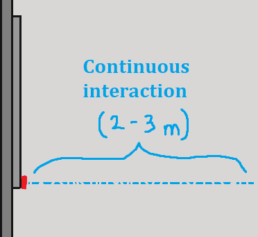
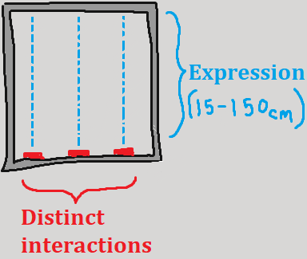

## __Tech Spec Considerations__

### *Continuous  Interaction*
The 2-3 meter continuous interaction will trigger some continuous event. A sonar sensor will sit fixed 1m up the wall, and point parallel to the floor out at foot traffic by the Center for Design. A steady flow of traffic can continuously trigger a sound to attract attention.

Care should be taken to make this sound as pleasant as possible so it sounds "believable" and truly continuous.

 

### *Focused  Interaction*
The "focused" interaction will take place in the plane of the window. By using IR sensors active between 15-150cm, the user can trigger multiple distinct sound events (arranged in x-axis) and play with the height of their hand in the window, which will function as a generic "expression" dimension (in the y-axis).

 

### *Software*
The code for this should be reasonably simple, and I am working on a program to test the activation, expression, and controllability of this hardware system. 

## __In Conclusion__
I will report on my findings on the hardware in about a week so we can get creative with our implementation. Any fine-tunings or adjustments later will be made easier once we test this hardware with our first idea.

Any and all feedback is welcome!
